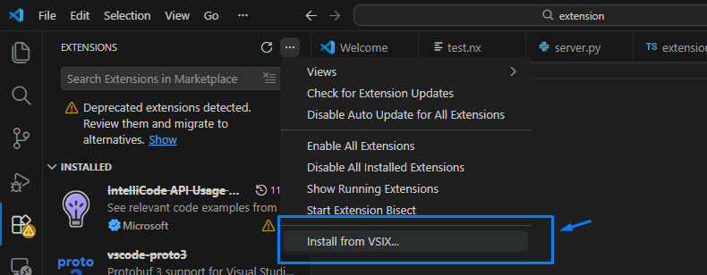

# Narex

[](https://opensource.org/licenses/MIT) [](https://www.python.org/)

If you have ever used regular expressions, then you know how difficult they can be. Some people, when confronted with a problem, think _“I know, I’ll use regular expressions.”_ Now they have two problems [[1]](https://regex.info/blog/2006-09-15/247).

Challenges of using regular expressions:
- Expressions easily become unreadable, as they are extremely dense.
- No standardization or cross-engine compatibility. Depending on the engine, it can vary significantly. Supported features and syntax often differ.
- Unnatural pattern memorization. Humans quickly forget the syntax, as it is not intuitive.
- The learning curve is steep, especially for non-tech users. Even though many non-tech users need data processing, regular expressions remain out of reach for them.

The ultimate goal is to produce a DSL that uses natural language and enables cross-engine compatibility.

The main use case is for the user to define the desired engine (Perl, Python, etc.) and write a regular expression using natural language. The output will be raw regular expression, which can be directly used within the specified engine.

This DSL can be widely used by people from different backgrounds, as it uses natural language. Tricky regular expressions are abstracted, and a universal tool for cross-engine support is provided. Learning this DSL frees you from ever having to remember regular expression syntax again.

The biggest issues are the vast number of engines, subtle differences, and partially supported advanced features. Due to the complexity of implementing a DSL that handles advanced features and multiple engine engines, support will be added gradually.

In the beginning, only the Python engine will be supported, covering its concepts.
Some of the advanced supported concepts include:
- `[uncaptured] group [<name> of]`
- `backreference <group_name>`
- `[negative] lookahead | lookbehind`

A user can also test regular expression by using `tests:`, define desired flags with `flags:`, and specify the desired engine using `engine:`.

### Note
#### Literal escaping
The user shouldn't perform any escaping of literals, as this could produce an inaccurate regex. Each literal enclosed in `''` will be escaped individually (e.g. `'!@'`). If the user provides two consecutive literal rules (e.g. `'@'` and `'.com'`), they will not be merged and escaped together.
#### Literal quotes
The user shouldn't use double quotes `"` more than twice when defining a literal value (e.g. wrong `""@"`, correct `"@"`). Similarly, the user shouldn't use single quotes `'` more than twice when defining a literal value (e.g. wrong `''@'`, correct `'@'`).

## Quick intro
### Match phone number 
``` py
""" 
    MATCH: +381 62 123 4567
    MATCH: 062/123-4567
    MATCH: 062-123-4567
    MATCH: 0621234567
    MATCH: 062 123 4567
    SKIP:  062.123.4567
"""

carrier {
      digit repeat 2 times
}

state {
      '+'
      digit between 1 and 9
      digit repeat 2 to 3 times
}

no_state {
      '0'
}

separator {
      maybe either '/' or '-' or whitespace
}

local {
      digit repeat 3 times
      separator
      digit repeat 4 times
}

phone_number {
      starts
      either state or no_state
      separator
      carrier
      separator
      local
      ends
}

flags:
      global match,
      multiline

engine:
      python

tests:
      "+381 62 123 4567",
      "062/123-4567",
      "062-123-4567",
      "0621234567",
      "062 123 4567",
      "062.123.4567"

target:
      phone_number 
```
### Generated code:
``` python
##############################################################
######################### Raw regex ########################## 
##############################################################
#
#  ^(\+[1-9]\d{2,3}|0)((\/|-|\s))?\d{2}((\/|-|\s))?\d{3}((\/|-|\s))?\d{4}$
#
##############################################################
########################### Engine ########################### 
##############################################################
#
#  Python
#
##############################################################
########################### Tests ############################ 
##############################################################
#
#  test 1:
#      pattern: 
#              +381 62 123 4567
#      match 1: 
#              +381 62 123 4567
#          group 1: 
#               ...
#
#  test 2:
#      pattern: 
#              062/123-4567
#      match 1: 
#              062/123-4567
#          group 1: 
#               ...
#
#  test 3:
#      pattern: 
#              062-123-4567
#      match 1: 
#              062-123-4567
#          group 1: 
#               ...
#
#  test 4:
#      pattern: 
#              0621234567
#      match 1: 
#              0621234567
#          group 1: 
#               ...
#
#  test 5:
#      pattern: 
#              062 123 4567
#      match 1: 
#              062 123 4567
#          group 1: 
#               ...
#
#  test 6:
#      pattern: 
#              062.123.4567
#      No matches
#
##############################################################
####################### Generated code ####################### 
##############################################################
import re

text = ""   # empty
regex = '^(\\+[1-9]\\d{2,3}|0)((\\/|-|\\s))?\\d{2}((\\/|-|\\s))?\\d{3}((\\/|-|\\s))?\\d{4}$'

match_strings = re.findall(
    regex, 
    text, 
    flags=re.MULTILINE
)
match_objects = re.finditer(
    regex, 
    text, 
    flags=re.MULTILINE
)
```

More examples can be found in [examples](./examples/) directory.

## Structure
```
Narex/
|
├── src/narex/
|         ├── validators/
|         ├── generators/
|         ├── grammar/
|         ├── utils/
|         ├── cli/
|
├── extension/
├── examples/
├── tests/
├── docs/
|
├── .github/workflows/
├── pyproject.toml
├── LICENSE
├── README.md
```
## Getting started:
Prerequsities:
- Python 3

_Check `pyproject.toml` for more info._

__NOTE:__ Don't activate the extension yet. If you already did, check [VSCode extension](#vscode-extension) section.

#### Regular user workflow

1. Create a virtual environment:
``` sh
python -m venv .venv
```
2. Activate the virtual environment (Windows):
``` sh
.\.venv\Scripts\activate 
```
3. Install dependencies:
``` sh
pip install git+https://github.com/Vasilijez/Narex.git
```
4. Run VSCode from activated terminal:
``` sh
code .
```
_Pulling of the source code is optional._

If you are a contributor, check the [developer workflow](#developer-workflow-getting-started).

### Using
You can use either of the two CLIs, Narex or textX.
This is possible as Narex belongs to the textX ecosystem. They share logic, although the commands are slightly different.

Run the project:

i. You can optionally validate the model before running:
``` sh
narex validate --path=<path>  # i.  Narex
textx check <path>            # ii. textX
```
ii. You can just run (includes validation):
``` sh
narex run --path=<path> --full            # i.  Narex    
textx generate <path> --target <engine>   # ii. textX
```

__Flags__ 
1. Please use `--help` flag at the beginning to understand all possible flags for certain command within concrete CLI.
2. `--path` and `--output-path` flags support both absolute and relative paths. For instance:
``` sh
--path=C:\Users\...\model.tx
--path=./model.tx
```
3. `--cli-only` flag provides only the raw regex within CLI. In contrast, when the flag is omitted, the full code is generated in a standalone file.
4. `--overwrite` flag provides overwriting the file if already exists.
5. `--output-path` flag is used for specifing the output directory path of the generated file.
6. `--engine` (Narex) or `--target` (textX) flag provides an engine selection. Engine can be defined within model clause `engine:` as well. Engine defined by using parameter has higher priority than the engine defined by using the model.

One example with as many flags as possible:
``` sh
narex run --path=input.nx --output-path=./dir --engine=python --overwrite     # i.  Narex
textx generate <path> target python --output-path=./dir --overwrite           # ii. textX
```

### VSCode extension
Prerequisites:
- Python VSCode extension (don't care now, it will be prompted if missing).

Before activating the extension, be sure to follow getting started either for [regular user](#regular-user-workflow) or for [developer](#developer-workflow-getting-started), as the extension requires all dependencies to be installed. If something goes wrong, check Troubleshooting.

#### Installation
1. Navigate to the `extension` directory in order to find the `narex-x.y.z.vsix` extension file.
2. Install the extension by choosing the `Install from VSIX `option.



#### Troubleshooting

Skip this section if the extension works fine for you. Continue if you still have headaches.

You must choose Python from one of the following:

- i. Virtual environment from an already running VSCode instance.
- ii. Global Python from an already running VSCode instance.
- iii. Terminal with an activated virtual environment used to open VSCode (explained earlier).

Therefore, your setup must have all Narex dependencies installed in order for the extension to work properly. The main hurdle is buggy VSCode behavior. For instance, you may create a virtual environment and install all dependencies, but the extension still may not work. Activating the virtual environment can be done by command, but sometimes VSCode refuses to choose Python from the virtual environment, even if the virtual environment is activated in the terminal.

Try restarting the extension by sequentially clicking the `Disable` and then `Enable` button, then check the Python path selected by VSCode. The Python path will be explicitly shown each time you rerun the extension. If you don't see something like: `Selected Python: c:\Users\John\Documents\GitHub\test\.venv\Scripts\python.exe` then you definitely didn't activate the virtual environment inside VSCode (green `(.venv)` is not enough). You will very likely see the path to the global Python `.exe`, where you don't have the required dependencies installed. 

The solution is to press `CTRL + SHIFT + P`, choose `Select Interpreter: ...`, and select `python.exe` from the `.venv/Scripts` directory.

## Contributing
As this project is open source, everyone is welcome to contribute. If you have any suggestions, feel free to propose them by opening an issue. The most interesting ones can be analyzed and placed within the `/docs` directory. Like, [Reverse engineering analysis](/docs/reverse_engineering.md).

### Developer workflow (getting started)
1. Clone the project:
``` sh
git clone https://github.com/Vasilijez/Narex.git
```
2. Change directory to Narex:
``` sh
cd Narex
```
3. Create and activate the virtual environment (Windows): 
``` sh
python -m venv .venv
.\.venv\Scripts\activate
```
5. Install mandatory dependencies:
``` sh
pip install -e .
```
6. Optionally, if developer needs all dependencies (e.g. tests):
``` sh
pip install -e ".[dev]"
```
7. Run VSCode from activated terminal:
``` sh
code .
```

### VSCode extension

1. If you want to play with the extension, open the `extension` subproject in VSCode and run the following command:
``` sh
npm install
```

2. Press the `F5` key in Windows to start extension debugging.

3. Packaging is possible by running the following:
``` sh
vsce package
```
4. After packaging, the extension's `.vsix` file will be available.

### Releasing
You can automatically trigger the release process by pushing a tag that starts with the letter `v`. For instance, `v1.2.3`.
1. Navigate to the main branch:
```
git checkout main
```
2. Make sure to pull the changes before tagging:
``` sh 
git pull
```
3. Create a new tag:
``` sh
git tag <tag-name>
```
4. Push the tag to the remote repository:
``` sh
git push origin <tag-name>
```

### Static analysis
You can do it on your own.

Run the static analysis locally:
``` sh
mypy --strict <file-name>
```
Caveat: Static analysis is triggered automatically by GitHub Actions. Therefore, it is smart to run a type checker from time to time before creating a pull request.

## References:
[1] [Source of the famous “Now you have two problems” quote](https://regex.info/blog/2006-09-15/247) _(Author: Jeffrey Friedl, Accessed: _July 19, 2025_)_